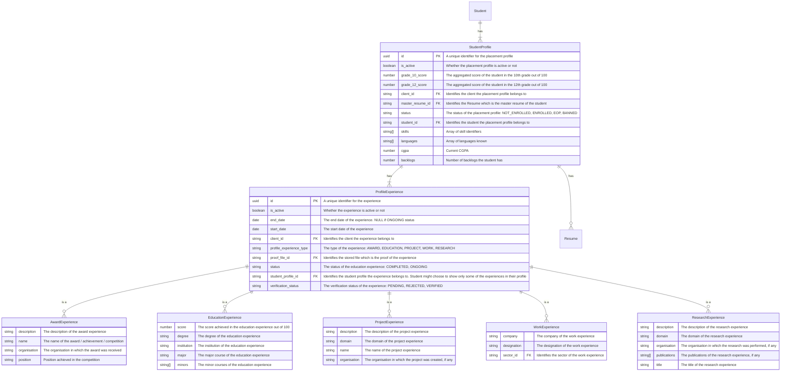

---
tags:
  - work/eminence/placement-automation
  - brainstorming
project_name: FutureScope
---
# FutureScope - Entities Involved

## Business-Level Entities

These entities will remain generic and used across clients.

### Business-Level Entities | Document Models

#### File Storage Map

Files will be uploaded to a file storage. Links to the uploaded files and their metadata will be stored in the database.

### Business-Level Entities | Relational Models

#### Client

The B2B Clients which we are operating for. It can be a college for now.

#### Plan-Feature Mapping

The plan which the client is on determines what features they get.

##### Plan-Feature Mapping Cache

Features will be few and Plans will be fewer. So, we can cache all of the features available to a client at the client level.

#### Role-Permission Mapping

Different Roles have different Permissions and access levels.

##### Role-Permission Mapping Cache

Permissions will be few and Roles will be fewer. So, we can cache all of the permissions available to a user at the user level.

#### User Authorisation

The user authorisation which the client can get.

## Client-Level Entities

### Client-Level Entities | Document Models

#### Case Comps

Represents the case competitions that the students can participate in.

#### Resume

Represents the resume of a student.

```mermaid
erDiagram
  Resume {
    uuid id PK "A unique identifier for the resume"
    boolean is_active "Whether the resume is active or not."
    string client_id FK "Identifies the client the resume belongs to"
    string comment_permission_group_id FK "Identifies the student group which has permission to comment on the resume, if any"
    string edit_permission_group_id FK "Identifies the student group which has permission to edit the resume, if any"
    string file_id FK "Identifies the stored file which is the resume"
    string resume_type "The type of the resume: MASTER, SECTORAL. A student can have only one MASTER resume"
    string[] section_order "The order of the sections in the resume"
    string sector_id FK "Identifies the sector of the resume. NULL for MASTER Resumes"
    string status "The status of the resume: DRAFT, ACTIVE"
    string student_id FK "Identifies the student the resume belongs to"
    string view_permission_group_id FK "Identifies the student group which has permission to view the resume, if any"
  }

  ResumePoint {
    uuid id PK "A unique identifier for the resume point"
    boolean is_active "Whether the resume point is active or not"
    boolean should_show "Whether the resume point should be shown in the resume"
    string client_id FK "Identifies the client the resume point belongs to"
    string proof_file_id FK "Identifies the stored file which is the proof of the resume point"
    string resume_id FK "Identifies the resume the point belongs to"
    string section "The section of the resume point: EDUCATION, EXPERIENCE, PROJECT, SKILLS, ACHIEVEMENTS"
    string text "The text of the resume point"
    string verification_status "The verification status of the experience: PENDING, REJECTED, VERIFIED"
  }

  Resume }|--o{ ResumePoint : "has"
  Resume ||--o{ StudentGroup : "contains"
```

#### Student

Represents the critical information of students of a client.

#### Student Profile

### Client-Level Entities | Relational Models

#### Company

Represents the companies which are hiring.

#### Events

Represents the events that the companies or institute is hosting.

#### Job Listings

Represents the job listings that the companies have posted.

#### Sector

Represents the sectors of career paths possible.

#### Student Complaints

Represents the complaints that the students have raised about them.

#### Student Groups - Custom

Represents custom groups of students that can be created by the client. These groups can be used for various purposes:

- Sending targeted emails or notifications
- Creating targeted custom case competitions, events, or job listings
- Generate chat rooms and forums for the group

### Client-Level Entities | Derived Models

#### Client Global Timeline

Students can see the client's global placement timeline anytime to stay updated on their placement journey.

##### Deriving Client Global Timeline

The client's global timeline can be derived from the events, case competitions, and job listings that the client has.

#### Student Groups - Generated

Represents the groups of students that are generated by the system based on various criteria.

- Based on the same previous Education Experience Degree / Major
- Based on applying for the same Job Listing
- Based on the same previous Project / Research Experience Domain
- Based on the same Sector Resume created
- Based on the same previous Work Experience Sector

```mermaid
erDiagram
  GeneratedStudentGroup {
    uuid id PK "A unique identifier for the generated student group"
    boolean is_active "Whether the generated student group is active or not"
    string client_id FK "Identifies the client the generated student group belongs to"
    string description "A description of the generated student group"
    string name "The name of the generated student group"
    string grouping_type "The type of the generated student group: EDUCATION_DEGREE, EDUCATION_MAJOR, JOB_LISTING_APPLIED, PROJECT_DOMAIN, RESEARCH_DOMAIN, RESUME_SECTOR, WORK_SECTOR"
  }

  GeneratedStudentEducationDegreeGroup {
    %% Inherits all fields from GeneratedStudentGroup %%
    string grouping_type "The type of the generated student group: EDUCATION_DEGREE"
    string degree "The degree of the education experience linking the students"
  }

  GeneratedStudentEducationMajorGroup {
    %% Inherits all fields from GeneratedStudentGroup %%
    string grouping_type "The type of the generated student group: EDUCATION_MAJOR"
    string major "The major course of the education experience linking the students"
  }

  GeneratedStudentJobListingAppliedGroup {
    %% Inherits all fields from GeneratedStudentGroup %%
    string grouping_type "The type of the generated student group: JOB_LISTING_APPLIED"
    string job_listing_id FK "Identifies the job listing the students have applied to"
  }

  GeneratedStudentProjectDomainGroup {
    %% Inherits all fields from GeneratedStudentGroup %%
    string grouping_type "The type of the generated student group: PROJECT_DOMAIN"
    string domain "The domain of the project experience linking the students"
  }

  GeneratedStudentResearchDomainGroup {
    %% Inherits all fields from GeneratedStudentGroup %%
    string grouping_type "The type of the generated student group: RESEARCH_DOMAIN"
    string domain "The domain of the research experience linking the students"
  }

  GeneratedStudentResumeSectorGroup {
    %% Inherits all fields from GeneratedStudentGroup %%
    string grouping_type "The type of the generated student group: RESUME_SECTOR"
    string sector_id FK "Identifies the sector of the resume linking the students"
  }

  GeneratedStudentWorkSectorGroup {
    %% Inherits all fields from GeneratedStudentGroup %%
    string grouping_type "The type of the generated student group: WORK_SECTOR"
    string sector_id FK "Identifies the sector of the work experience linking the students"
  }

  EducationExperience }o--|| GeneratedStudentEducationDegreeGroup : "creates"
  EducationExperience }o--|| GeneratedStudentEducationMajorGroup : "creates"
  JobListing }o--|| GeneratedStudentJobListingAppliedGroup : "creates"
  ProjectExperience }o--|| GeneratedStudentProjectDomainGroup : "creates"
  ResearchExperience }o--|| GeneratedStudentResearchDomainGroup : "creates"
  Resume }o--|| GeneratedStudentResumeSectorGroup : "creates"
  WorkExperience }o--|| GeneratedStudentWorkSectorGroup : "creates"

  GeneratedStudentGroup ||--o{ GeneratedStudentEducationDegreeGroup : "is a"
  GeneratedStudentGroup ||--o{ GeneratedStudentEducationMajorGroup : "is a"
  GeneratedStudentGroup ||--o{ GeneratedStudentJobListingAppliedGroup : "is a"
  GeneratedStudentGroup ||--o{ GeneratedStudentProjectDomainGroup : "is a"
  GeneratedStudentGroup ||--o{ GeneratedStudentResearchDomainGroup : "is a"
  GeneratedStudentGroup ||--o{ GeneratedStudentResumeSectorGroup : "is a"
  GeneratedStudentGroup ||--o{ GeneratedStudentWorkSectorGroup : "is a"
  GeneratedStudentGroup ||--o{ StudentGroupMember : "has"
  StudentGroupMember ||--|| Student : "has"
```

## Notes

1. Multi-tenant structure?
2. We are selling an entire ecosystem: Maybe don't focus too much on feature flags now.
