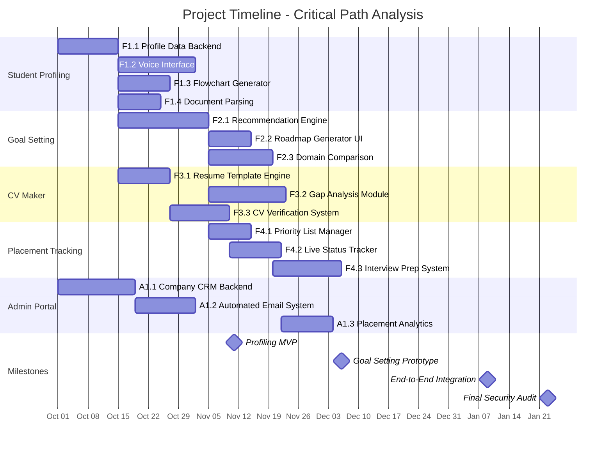
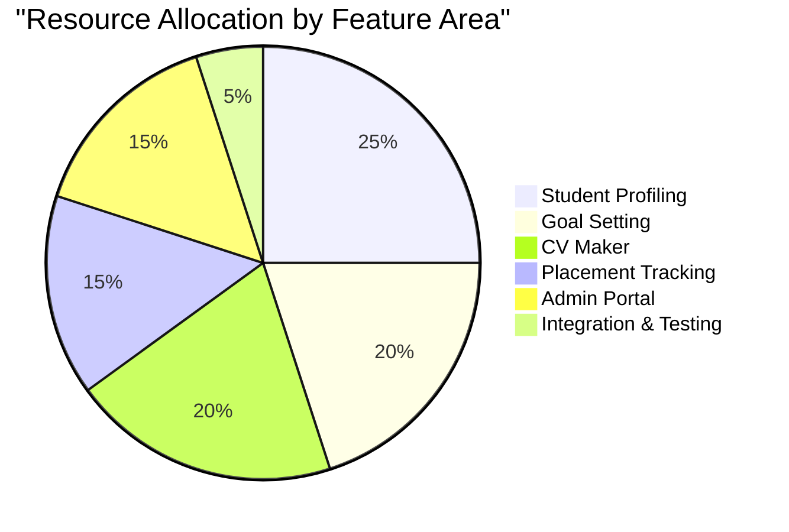
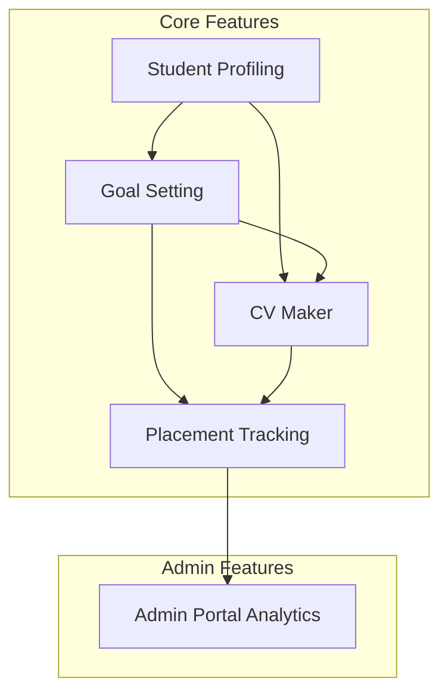
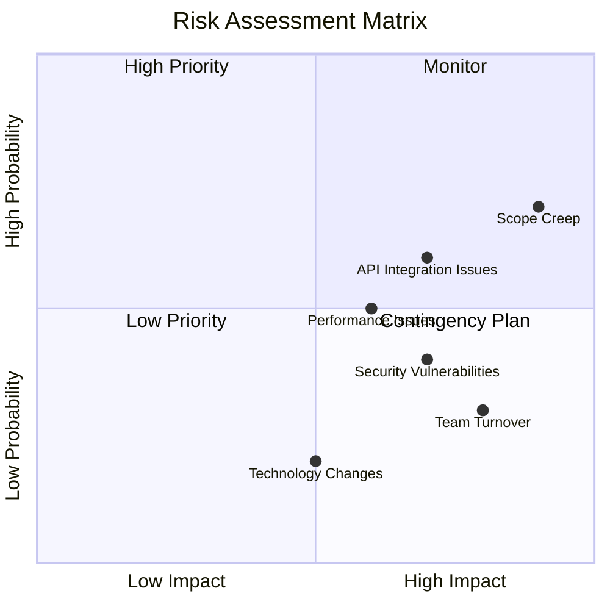
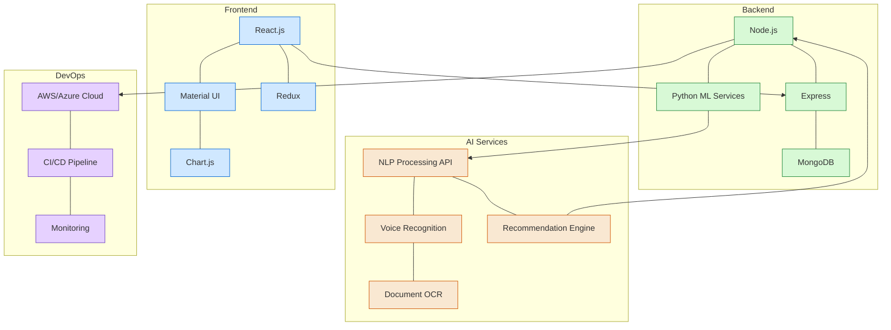
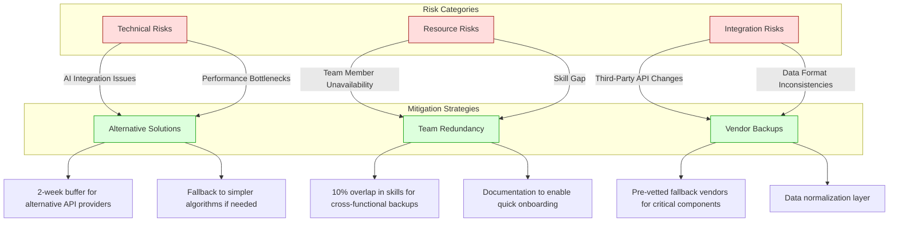
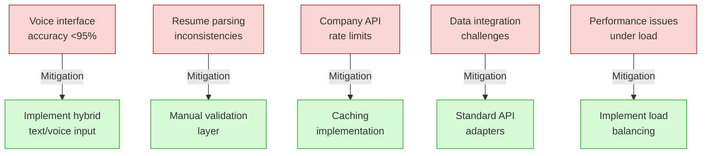
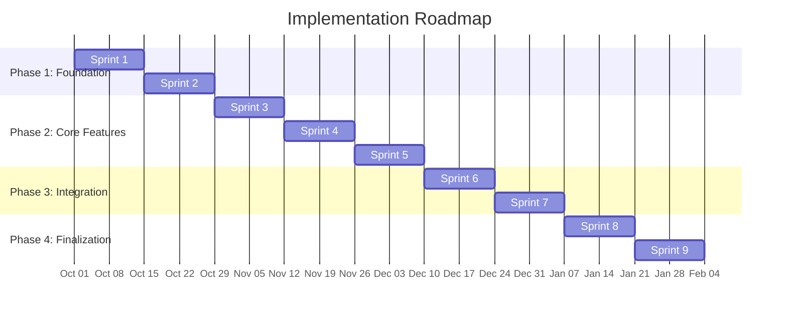
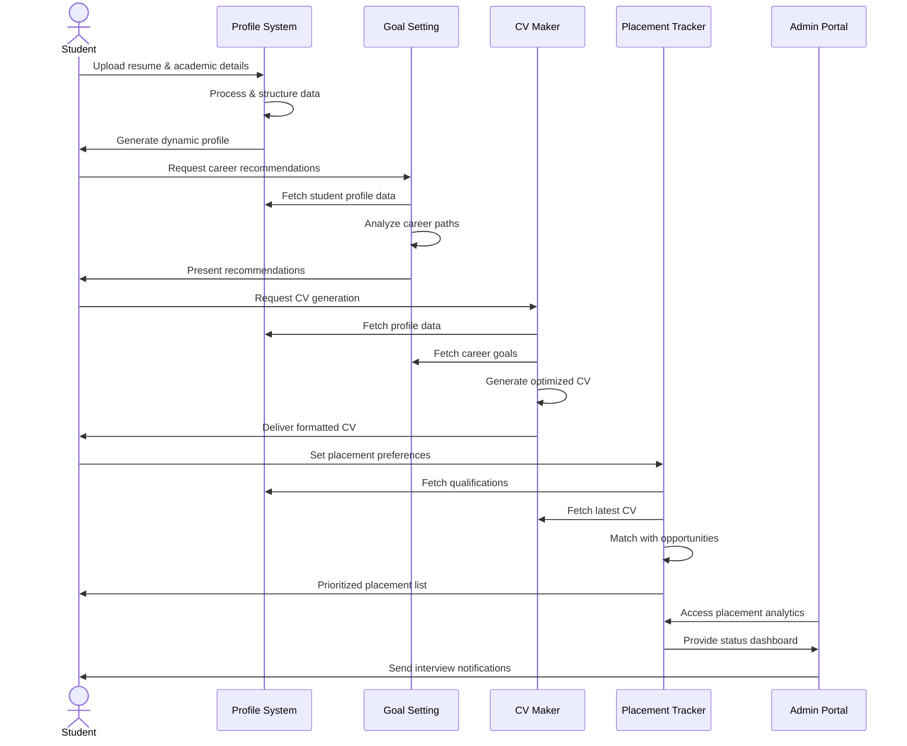

# Project Estimation - Resume Builder, Verifier and Company Outreach

## Assumptions

1. Founders handle product management & design at no cost
2. Only Junior Software Development Engineers (SDEs) are hired
3. 8-hour work days, 5-day work weeks
4. Basic cloud infrastructure available
5. Third-party AI APIs (voice processing, NLP) available with 2-week integration buffer
6. 20% buffer added for integration risks
7. Parallel task execution where no dependencies exist

## Team Compositions

| Scenario         | Team Size     | Experience Level     | Coordination Needs         |
| ---------------- | ------------- | -------------------- | -------------------------- |
| Under-resourced  | 3 SDEs        | 0-1 year experience  | Daily standups + mentoring |
| Well-structured  | 5 SDEs        | 1-2 years experience | Bi-weekly checkins         |
| Over-provisioned | 4 Senior SDEs | 2-3 years experience | Weekly syncs               |

## Work Breakdown Structure (WBS)

### Feature 1: AI-Powered Student Profiling

| Task ID | Task Description                      | Standard Duration | Dependencies |
| ------- | ------------------------------------- | ----------------- | ------------ |
| F1.1    | Profile Data Backend (NoSQL DB + API) | 14 days           | -            |
| F1.2    | Voice Interface Development           | 18 days           | F1.1         |
| F1.3    | Dynamic Flowchart Generator           | 12 days           | F1.1         |
| F1.4    | Document Parsing Integration          | 10 days           | F1.1         |

### Feature 2: AI-Driven Goal Setting

| Task ID | Task Description                  | Standard Duration | Dependencies |
| ------- | --------------------------------- | ----------------- | ------------ |
| F2.1    | Career Path Recommendation Engine | 21 days           | F1.1         |
| F2.2    | Roadmap Generator UI              | 10 days           | F2.1         |
| F2.3    | Domain Comparison System          | 15 days           | F2.1         |

### Feature 3: AI-Powered CV Maker

| Task ID | Task Description       | Standard Duration | Dependencies |     |
| ------- | ---------------------- | ----------------- | ------------ | --- |
| F3.1    | Resume Template Engine | 12 days           | F1.1         |     |
| F3.2    | Gap Analysis Module    | 18 days           | F1.3, F2.1   |     |
| F3.3    | CV Verification System | 14 days           | F3.1         |     |

### Feature 4: Placement Tracking

| Task ID | Task Description      | Standard Duration | Dependencies |
| ------- | --------------------- | ----------------- | ------------ |
| F4.1    | Priority List Manager | 10 days           | F2.1         |
| F4.2    | Live Status Tracker   | 12 days           | F3.3         |
| F4.3    | Interview Prep System | 16 days           | F2.3         |

### Admin Portal

| Task ID | Task Description       | Standard Duration | Dependencies |
| ------- | ---------------------- | ----------------- | ------------ |
| A1.1    | Company CRM Backend    | 18 days           | -            |
| A1.2    | Automated Email System | 14 days           | A1.1         |
| A1.3    | Placement Analytics    | 12 days           | F4.2         |

## Resource Allocation

The resource allocation shows the distribution of development effort across the major feature areas of the project. Student profiling receives the highest allocation as it forms the foundation of the platform.

## Feature Dependencies Flowchart

## Risk Assessment Matrix

## Timeline Estimation

### Effort Table

| Task ID | Effort (Days) | Parallelizable? |
|---------|---------------|-----------------|
| F1.1    | 14            | No              |
| F1.2    | 18            | No              |
| F1.3    | 12            | Yes             |
| F2.1    | 21            | No              |
| F2.3    | 15            | No              |
| F3.2    | 18            | No              |
| F4.3    | 16            | Yes             |
| A1.2    | 14            | Yes             |

### Duration Scenarios

1. **Under-resourced Team (3 SDEs)**
   - Multiplier: 1.6x (learning curve)
   - Critical Path: (14+18+21+15+18+16) \* 1.6 = 163 days
   - Buffer: 32 days (20%)
   - **Total: 195 days**

2. **Well-structured Team (5 SDEs)**
   - Multiplier: 1x
   - Critical Path: 14+18+21+15+18+16 = 102 days
   - Buffer: 20 days
   - **Total: 122 days**

3. **Over-provisioned Team (8 SDEs)**
   - Multiplier: 0.8x (diminishing returns)
   - Critical Path: (102) \* 0.8 = 82 days
   - Buffer: 16 days
   - **Total: 98 days**

## Cost Estimation

- Junior SDE Rate: ₹700/day (8hrs)
- Buffer Costs calculated at 50% of base rate

| Scenario            | Direct Cost                     | Buffer Cost              | Total Cost               |
|---------------------|---------------------------------|--------------------------|--------------------------|
| Under-resourced     | 3 devs × 163d × ₹700 = ₹342,300 | ₹171,150                | ₹513,450                |
| Well-structured     | 5 devs × 102d × ₹700 = ₹357,000 | ₹178,500                | ₹535,500                |
| Over-provisioned    | 8 devs × 82d × ₹700 = ₹459,200  | ₹229,600                | ₹688,800                |

## Summary Table

| Scenario         | Duration | Total Cost | Risk Profile      |
| ---------------- | -------- | ---------- | ----------------- |
| Under-resourced  | 195 days | ₹513k      | High burnout risk |
| Well-structured  | 122 days | ₹535k      | Balanced delivery |
| Over-provisioned | 98 days  | ₹688k      | Fast but costly   |

## Technology Stack

The proposed technology stack balances modern frameworks with stability and performance. The stack is designed to support AI integration while maintaining a responsive user experience. Third-party AI services will be leveraged where appropriate to accelerate development while custom ML models will be developed for core recommendation features.

## Contingency Plan

The contingency plan addresses key risk areas with specific mitigation strategies. Each strategy includes concrete actions that will be taken if the risk materializes. The plan is designed to minimize disruption to the project timeline while maintaining quality standards.

## Feedback Checkpoints

1. Profiling MVP (Week 6)
2. Goal Setting Prototype (Week 10)
3. End-to-End Integration (Week 15)
4. Final Security Audit (Week 17)

## Blockers and Mitigation Strategies

Each identified blocker has a corresponding mitigation strategy to ensure project continuity. The team will proactively monitor these potential issues and implement the mitigation strategies as needed.

## Implementation Roadmap

The implementation follows an agile approach with 2-week sprints. Each sprint will deliver incremental functionality and will be reviewed with stakeholders.

## User Journey

## Conclusion and Recommendations

Based on our analysis, we recommend proceeding with the **Well-structured Team** approach using 5 SDEs with 1-2 years of experience. This option provides the optimal balance between delivery timeline (122 days) and cost (₹535,500).

Key recommendations:

- Begin with the foundation components (Profile Data Backend) as they are critical dependencies
- Implement a bi-weekly stakeholder review process aligned with sprint completions
- Maintain flexible resource allocation to address blockers as they arise
- Consider additional investment in automated testing to ensure quality of the AI components
- Plan for a phased rollout, starting with core features followed by enhanced capabilities

This implementation strategy provides the best mix of risk management, cost efficiency, and timeline certainty while delivering a high-quality product that meets the requirements of IIM Bangalore.
